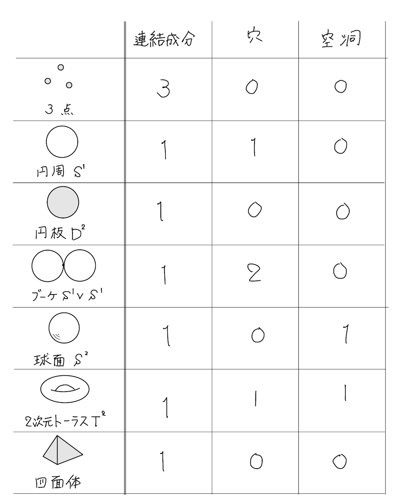
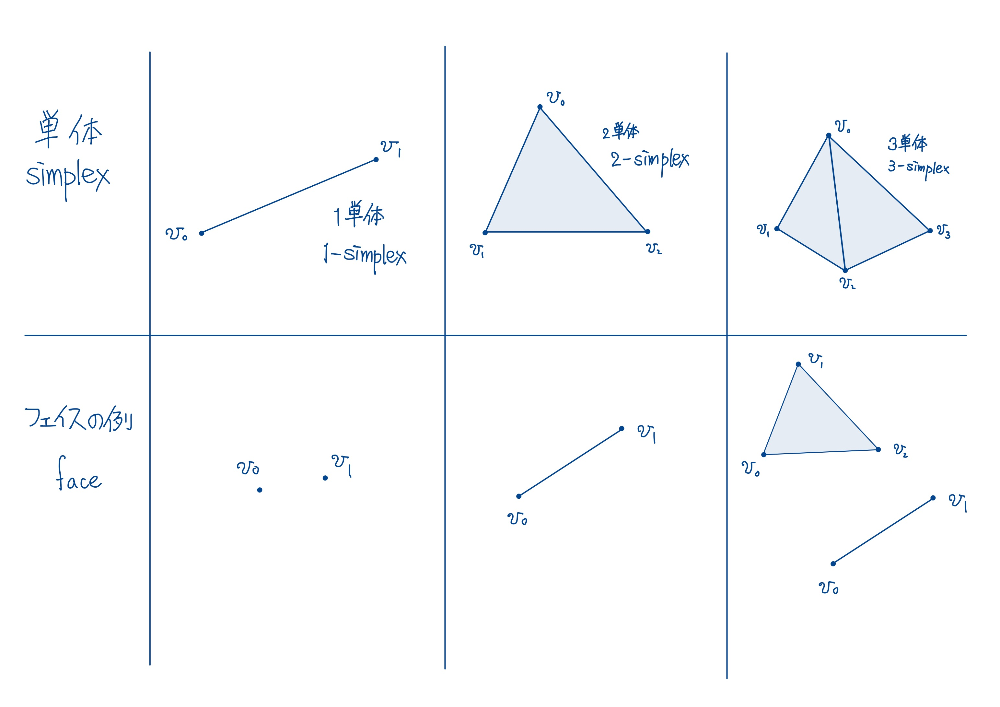
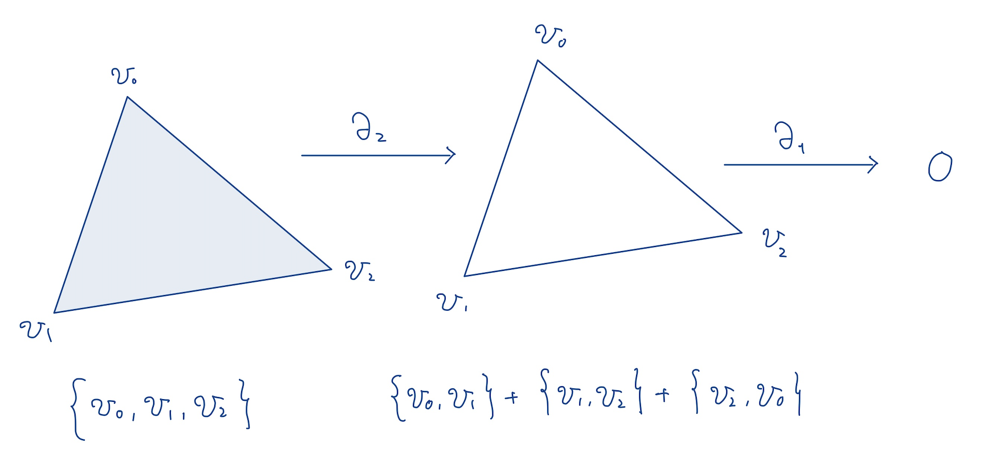
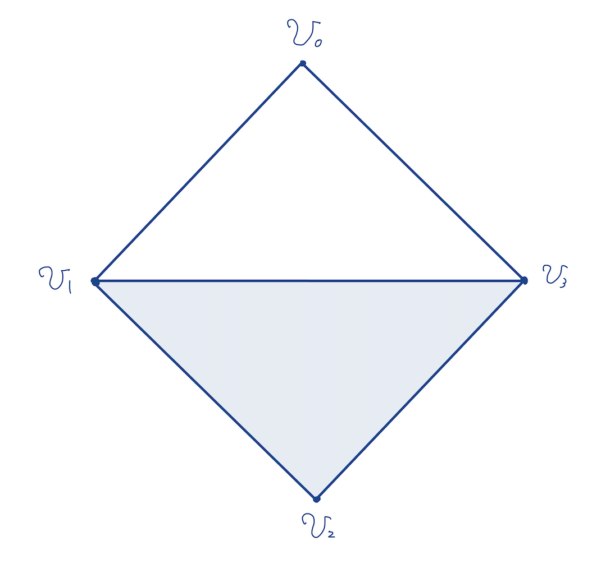

与えられた幾何的対象に対して，目的に応じた特徴付けを行うことで，その対象を詳細に調べたり他の対象との比較を行うことができる。例えば，辺の長さが1である正四面体と立方体の体積はそれぞれ${\sqrt{2}} / {12}$と$1$であり，立方体の方が正四面体よりも空間的に大きいことがわかる。一方で，ホモロジー理論は「穴」に注目して図形の特徴量を抽出するための手法である。例えば円周$S^1$は内部に「穴」をもつが，円盤$D^2$は内部に「穴」をもたない。したがって，$S^1$と$D^2$はそれぞれ異なる「穴」の特徴を持っている。あるいは，下図のように連結成分や空洞による特徴付けができる。

:::figcaption
各図形がもつ連結成分，穴，および，空洞の個数
:::

$3$次元以下のEuclid空間に実現可能かつ単純な図形であれば，図形を実際に図示することによって「穴」を見つけることができるが，$4$次元以上の図形や複雑な図形になると視覚的に「穴」を抽出することができない。そこで代数的に図形（より一般には位相空間）の「穴」を解析できるのがホモロジー理論である。

以下では単体複体という最も単純な場合について，このホモロジー理論を説明する。

#### 単体複体

:::dfn
$\mathbb{R}^N$上の$k + 1$個の点$v_0, \cdots, v_{k}$に対して，$v_1 - v_0, \cdots, v_k - v_0$が$1$次独立であるとき，$v_0, v_1, \cdots, v_{k}$は一般の位置にあるという。
:::

:::dfn
$\mathbb{R}^N$の部分集合$A$に対して，$A$を含む最小の凸集合$C$を$A$の凸包といって，$C = \mathrm{Conv}\kakko{A}$と表す。
:::

:::prop
$\mathbb{R}^N$上の一般の位置にある$k + 1$個の点$v_0, \cdots, v_k$に対して，

$$
\begin{align*}
  \braket{v_0\cdots v_k} = \Set{\sum_{i = 0}^k t_iv_i | t_i\geq 0\ \kakko{i = 0, 1, \cdots, k},\ \sum_{i = 0}^k t_i = 1}
\end{align*}
$$

とおくと，

$$
\begin{align*}
  \mathrm{Conv}\kakko{\Set{v_0, \cdots, v_k}} = \braket{v_0\cdots v_k}
\end{align*}
$$

となる。
:::

:::proof
略
:::

:::dfn
$V = \Set{v_0, \cdots, v_k}$を$\mathbb{R}^N$上の一般の位置にある$k + 1$個の点の集合とする。

1. 点$v_0, \cdots, v_k$を包む凸包$\sigma = \braket{v_0\cdots v_k}$を$V$を頂点とする$k$単体という。また，$\dim \sigma = k$を$\sigma$の次元という。
2. $l$個の点$v_{i_0}, \cdots, v_{i_l}\in V$に対して，$l$次元単体$\sigma = \braket{v_{i_0}\cdots v_{i_l}}$を$k$次元単体$\tau = \braket{v_0\cdots v_k}$のフェイスといい，$\sigma \prec \tau$と表す。

:::

:::figcaption
単体とそのフェイスの例
:::

:::dfn{.important}
$\mathbb{R}^N$上の有限個の単体からなる集合$K$が次の条件を満たすとき，$K$を有限単体複体という

1. 任意の単体$\tau\in K$に対して，$\tau$の任意のフェイス$\tau$は$K$に含まれる。
2. 任意の単体$\sigma, \tau\in K$のに対して，$\sigma\cap\tau\neq\emptyset$であるならば，$\sigma\cap\tau$は$\sigma$のフェイスであり，$\tau$のフェイスである。

:::

単体複体の性質から、各々の単体はその頂点の集合で完全に決定され、複体を頂点全体の集合とその部分集合の族の組として組合せ論的に表示することができる。この様に組合せ論的に表示された複体を抽象単体複体と呼ぶ。

:::dfn{.important}
$V$を有限集合とする。$V$の部分集合からなる集合$K$が次の条件を満たすとき，$K$は$V$を頂点とする抽象的単体複体であるという。

1.  $\emptyset\in K$である。
2.  任意の$v\in V$に対して，$\Set{v}\in K$である。
3.  空ではない$V$の部分集合$\tau$に対して，ある$\sigma\in K$が存在して，$\tau\subset\sigma$ならば$\tau\in K$である。

$\dim\sigma = \#\sigma-1$と定めて，$\dim\sigma$を$\sigma$の次元といい，$\dim K = \max_{\sigma\in K}\kakko{\dim\sigma}$を$K$の次元という。$\sigma\in K$が$\dim\sigma = k$を満たすとき，$\sigma$は$k$単体であるという。任意の$\sigma\in K$に対して，ある$\tau\in K$が存在して，$\tau\subset\sigma$となるとき，$\tau$は$\sigma$のフェイスであるという。
:::

**以下では，抽象的単体複体を単に単体複体という。**

:::dfn
単体複体$K$に対して$K$の部分集合$K^\prime$が単体複体となるとき，$K^\prime$は$K$の部分複体であるという。
:::

:::dfn
$K$を単体複体とする。負ではない整数$k$に対して，$k$単体の集合で自由生成される$\mathbb{F}_2$上のベクトル空間

$$
\begin{align*}
  C_k\kakko{K;\mathbb{F}_2} = \bigoplus_{\sigma\in K, \dim\sigma = k} \mathbb{F}_2\sigma
\end{align*}
$$

を$k$次元チェイン空間といい，$C_k\kakko{K;\mathbb{F}_2}$の元を$k$次元チェインという。ただし，$C_{-1}\kakko{K;\mathbb{F}_2} = 0$と定める。
:::

以下では$C_k\kakko{K;\mathbb{F}_2}$ = $C_k\kakko{K}$と書くことがある。

:::dfn{.important}
$K$を単体複体とし，$k$を正の整数とする。$k$単体$\sigma = \Set{v_0, v_1, \cdots, v_k}\in C_k\kakko{K}$に対して，

$$
  \begin{align*}
    \partial_k\sigma = \sum_{i = 0}^k \Set{v_0, \cdots, \widehat{v_i}, \cdots, v_k}
  \end{align*}
$$

と定める。このとき定まる線型写像

$$
\begin{align*}
  \partial_k:C_k\kakko{K}\to C_{k - 1}\kakko{K}
\end{align*}
$$

を境界準同型という。ただし，$\partial_0 = 0$とする。
:::

:::eg
下図に示すような三角形$T = \Set{v_0, v_1, v_2}$を考える。$T$に対して，

$$
\begin{align*}
  \partial_2 T = \Set{v_0, v_1} + \Set{v_1, v_2} + \Set{v_2, v_0}
\end{align*}
$$

となる。このように，境界準同型は単体の境界を与える。

また，三角形の周$U = \Set{v_0, v_1} + \Set{v_1, v_2} + \Set{v_2, v_0}$に対して，

$$
\begin{align*}
  \partial_1 U = 0
\end{align*}
$$

となる。このように，任意の単体の境界は境界準同型の核に含まれる。
:::

:::figcaption
境界準同型の作用
:::

以上の例から，図形の「穴」は次の条件によって定式化するのが自然である。

1. 境界準同型の核に含まれる。
2. 他の単体の境界になっていない。

他の単体の境界全体からなる集合が$\mathrm{Im}\ \partial_k$であることを考えると，図形の「穴」となる単体は$\mathrm{Ker}\ \partial_k \backslash\mathrm{Im}\ \partial_{k + 1}$で与えられそうである。しかしこれでは不十分である。例えば

$$
\begin{align*}
  K^{\kakko{0}} & = \Set{
    \Set{v_0}, \Set{v_1}, \Set{v_2}, \Set{v_3},
  }                       \\
  K^{\kakko{1}} & = \Set{
    \Set{v_0, v_1}, \Set{v_1, v_2}, \Set{v_2, v_3}, \Set{v_3, v_0}, \Set{v_1, v_3}
  }                       \\
  K^{\kakko{2}} & = \Set{
    \Set{v_1, v_2, v_3}
  }
\end{align*}
$$

に対して，下図に示すような単体複体

$$
\begin{align*}
  K = K^{\kakko{0}}\cup K^{\kakko{1}}\cup K^{\kakko{2}}
\end{align*}
$$

を考えると，$K$に含まれる二つの単体

$$
\begin{align*}
  \sigma & =
    \Set{v_0, v_1} + \Set{v_1, v_3} + \Set{v_3, v_0}\\
  \tau   & =
    \Set{v_0, v_1} + \Set{v_1, v_2} + \Set{v_2, v_3}+ \Set{v_3, v_0}
\end{align*}
$$

は同じ「穴」を表すが，違うものとして扱われる。ここで，

$$
\begin{align*}
  \tau - \sigma = \Set{v_1, v_2} + \Set{v_2, v_3} + \Set{v_3, v_1} \in \mathrm{Im}\ \partial_2
\end{align*}
$$

となることに注意すれば，$\tau$と$\sigma$を同一視するという条件のもとで，単体複体$K$の「穴」からなる集合は

$$
\begin{align*}
  H_k\kakko{K} = \mathrm{Ker}\ \partial_k / \mathrm{Im}\ \partial_{k + 1}
\end{align*}
$$

と表せる。

:::figcaption
$K$の幾何的実現
:::

:::dfn{.important}
$K$を単体複体とし，$\partial_k$を$K$に付随する$k$次境界準同型とする。このとき，

$$
\begin{align*}
  H_k\kakko{K} = \mathrm{Ker}\ \partial_k / \mathrm{Im}\ \partial_{k + 1}
\end{align*}
$$

を$K$の$k$次ホモロジー群という。また，$Z_k\kakko{K} = \mathrm{Ker}\ \partial_k$を$k$次サイクル，$B_k\kakko{K} = \mathrm{Im}\ \partial_{k + 1}$を$k$次バウンダリという。
:::

:::thm
$K^\prime$を単体複体$K$の部分複体とし，$\iota: K^\prime \hookrightarrow K$を包含写像とする。このとき，自然な線型写像

$$
\begin{align*}
  \iota_*: H_k\kakko{K^\prime}\to H_k\kakko{K}
\end{align*}
$$

が存在する。
:::

:::proof
略
:::

:::dfn
$K,L$を単体複体とし，$V\kakko{K}$および$V\kakko{L}$をそれぞれ$K$および$L$の頂点集合とする。$f: V\kakko{K}\to V\kakko{L}$が，任意の単体$\Set{v_0, \cdots, v_k}\in K$に対して，$\Set{f\kakko{v_0}, \cdots, f\kakko{v_k}}\in L$を満たすとき，$f$を$K$から$L$への単体写像という。
:::

:::thm
$K,L$を単体複体とし，$f: K\to L$を単体写像とするとき，自然な線型写像

$$
\begin{align*}
  f_*: H_k\kakko{K}\to H_k\kakko{L}
\end{align*}
$$

が存在する。
:::

:::proof
略
:::
