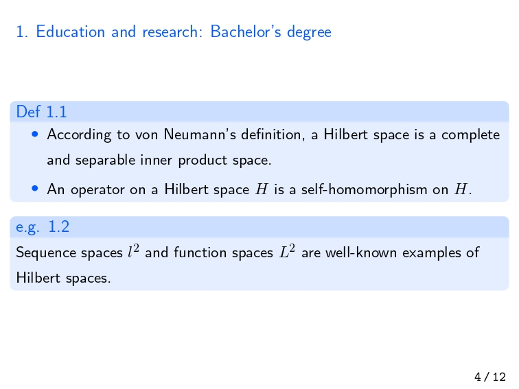

研究室のゼミとかで使うので，最近数式入りのスライドをよく作ってます。僕は$\LaTeX$信者なのでスライドも$\LaTeX$で作っていたわけですが，最近になって[Beamer](https://github.com/josephwright/beamer)を使い始めました。Beamer自体は大学の授業で先生が使っていてよく目にしてはいたのですが，スライド内の数式がsans-serif体になっていてとても見栄えが悪く，資料のフォーマットにこだわる私としては使うに至らないものでした。ただ，最近になってBeamerでもserif体で数式が使えることを知り，今日において使うに至るというわけです。

実際に利用しているプリアンプルは以下みたいな感じです。_colorと_slide_proof_envとは僕が定義しているスタイルで，それぞれ色と証明環境を設定しています。
```tex
\usepackage{bxdpx-beamer}
\usepackage{pxjahyper}
\usepackage{minijs}
\usepackage{mathtools}
\usepackage{_color}
\usepackage{_slide_proof_env}

\renewcommand{\kanjifamilydefault}{\gtdefault}

\usetheme{Boadilla}
\usefonttheme[onlymath]{serif}
\setbeamertemplate{navigation symbols}{}
\setbeamertemplate{footline}[page number]
\setbeamertemplate{blocks}[rounded]
\setbeamertemplate{frametitle}{\vspace{3mm}\thesection. \insertframetitle}
\setbeamertemplate{itemize items}[circle]
\setbeamerfont{footline}{size=\fontsize{9}{11},family=\ttfamily}
\setbeamerfont{frametitle}{size=\large}
\setbeamercolor{structure}{fg=ublue}
\setbeamercolor{alerted text}{fg=ured}
\setbeamercolor{example text}{fg=ugreen}

\renewcommand{\baselinestretch}{1.3}
```

出来栄えはこんな感じ。結構いいね。今後もっと改善していけたらいいな。

